# Prueba_Tecnica_R5

#Detallado de las pruebas

Quisiera compartir con ustedes el detallado de las pruebas recientemente ejecutadas en el sistema, así como la visión general del seguimiento y las acciones recomendadas.

Detalles de las Pruebas:

Caso de Prueba: Login
    - Pruebas realizadas: 17
Desglose por tipo de prueba:
    - Pruebas Unitarias (PU): 35%
    - Pruebas Funcionales (PF): 47%
    - Pruebas No Funcionales (PNF): 6%
    - Pruebas Integración (PI): 12%
    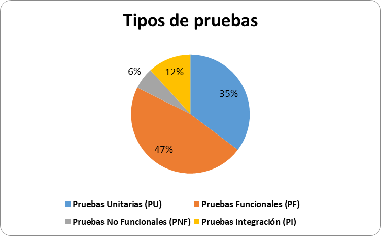
Estados resultantes:
    - No ejecutado: 0
    - Bloqueado: 0
    - Fallado: 7
    - Pasado: 10
    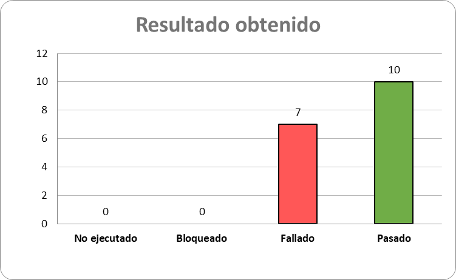

Caso de Prueba: standard_user
    - Pruebas realizadas: 46
Desglose por tipo de prueba:
    - Pruebas Unitarias (PU): 26%
    - Pruebas Funcionales (PF): 57%
    - Pruebas No Funcionales (PNF): 17%
    - Pruebas Integración (PI): 0%
    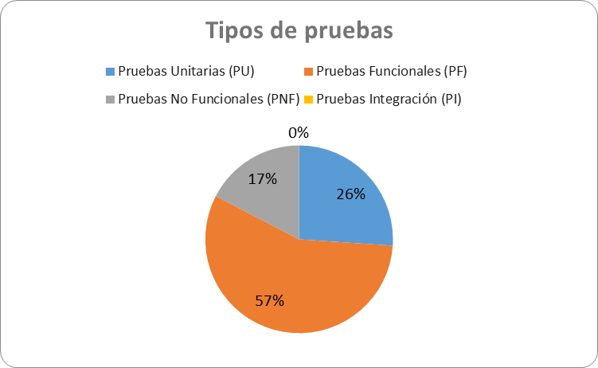
Estados resultantes:
    - No ejecutado: 0
    - Bloqueado: 0
    - Fallado: 12
    - Pasado: 34
    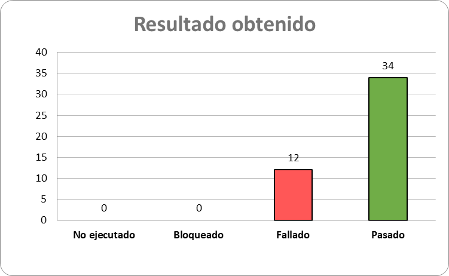

Caso de Prueba: locked_out_user
    - Pruebas realizadas: 46
Desglose por tipo de prueba:
    - Pruebas Unitarias (PU): 26%
    - Pruebas Funcionales (PF): 57%
    - Pruebas No Funcionales (PNF): 17%
    - Pruebas Integración (PI): 0%
    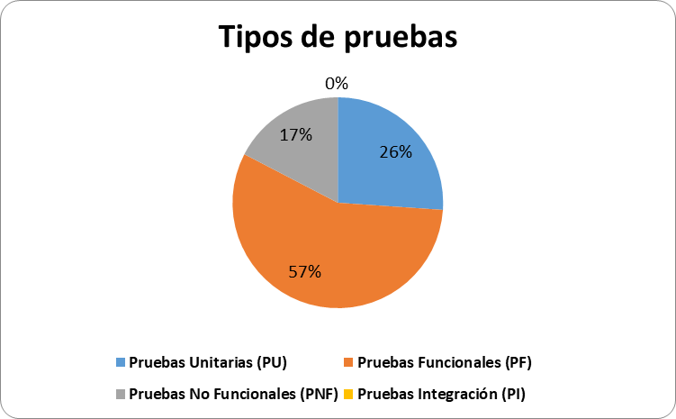
Estados resultantes:
    - No ejecutado: 46
    - Bloqueado: 0
    - Fallado: 0
    - Pasado: 0
    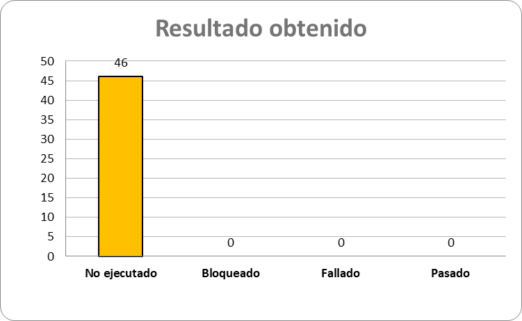

Caso de Prueba: problem_user
    - Pruebas realizadas: 46
Desglose por tipo de prueba:
    - Pruebas Unitarias (PU): 26%
    - Pruebas Funcionales (PF): 57%
    - Pruebas No Funcionales (PNF): 17%
    - Pruebas Integración (PI): 0%
    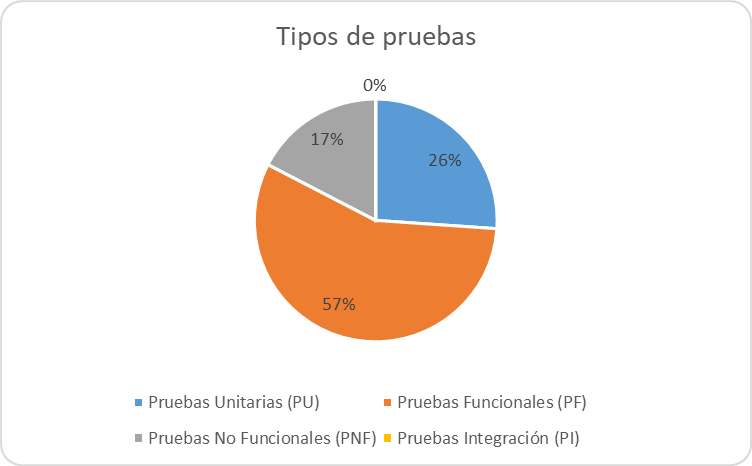
Estados resultantes:
    - No ejecutado: 8
    - Bloqueado: 1
    - Fallado: 18
    - Pasado: 19
    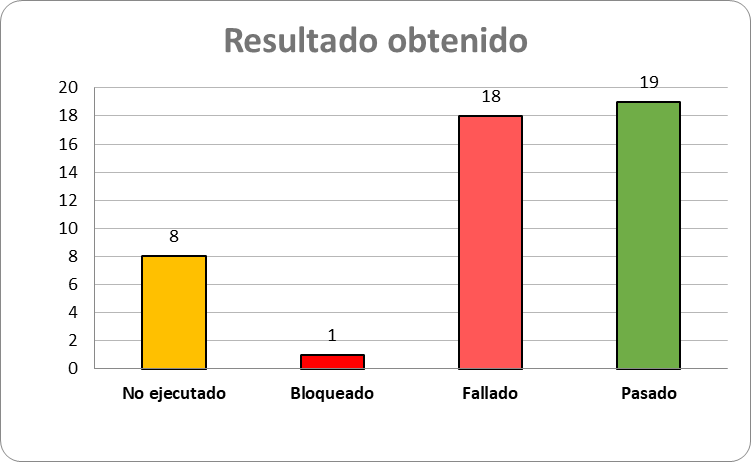

Caso de Prueba: performance_glitch_user
    - Pruebas realizadas: 46
Desglose por tipo de prueba:
    - Pruebas Unitarias (PU): 26%
    - Pruebas Funcionales (PF): 57%
    - Pruebas No Funcionales (PNF): 17%
    - Pruebas Integración (PI): 0%
    
Estados resultantes:
    - No ejecutado: 0
    - Bloqueado: 0
    - Fallado: 17
    - Pasado: 29
    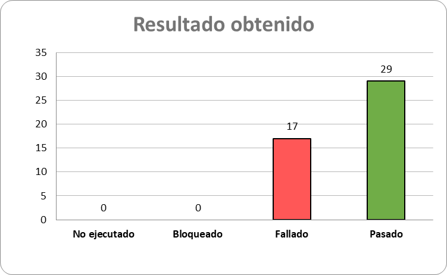

Caso de Prueba: error_user
    - Pruebas realizadas: 46
Desglose por tipo de prueba:
    - Pruebas Unitarias (PU): 26%
    - Pruebas Funcionales (PF): 57%
    - Pruebas No Funcionales (PNF): 17%
    - Pruebas Integración (PI): 0%
    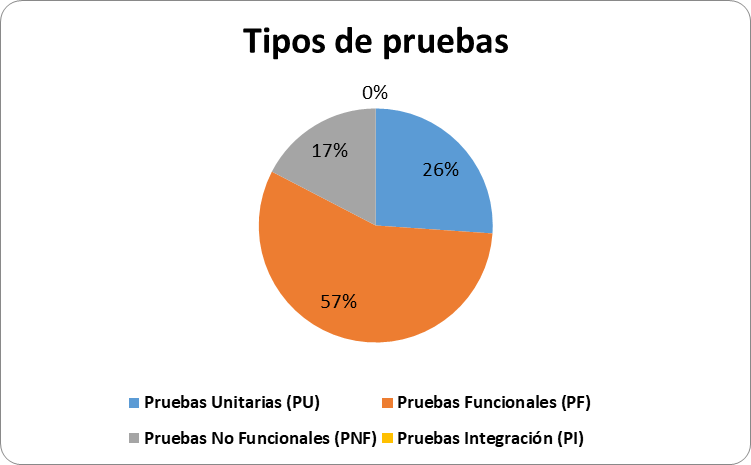
Estados resultantes:
    - No ejecutado: 4
    - Bloqueado: 1
    - Fallado: 18
    - Pasado: 23
    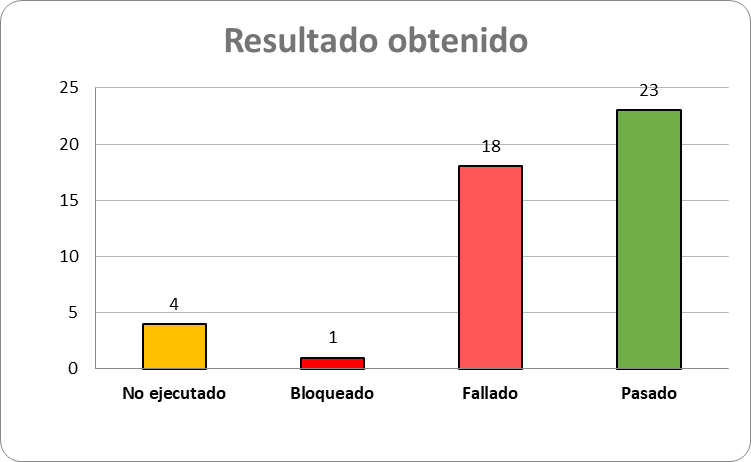

Caso de Prueba: visual_user
    - Pruebas realizadas: 48
Desglose por tipo de prueba:
    - Pruebas Unitarias (PU): 25%
    - Pruebas Funcionales (PF): 54%
    - Pruebas No Funcionales (PNF): 21%
    - Pruebas Integración (PI): 0%
    
Estados resultantes:
    - No ejecutado: 0
    - Bloqueado: 0
    - Fallado: 16
    - Pasado: 32
    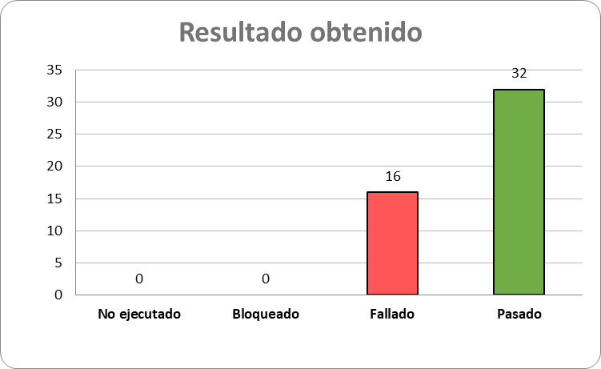

#Resultado Final de las Pruebas:

Tipos de pruebas:
    - Pruebas Unitarias (PU): 26%
    - Pruebas Funcionales (PF): 56%
    - Pruebas No Funcionales (PNF): 17%
    - Pruebas Integración (PI): 1%
    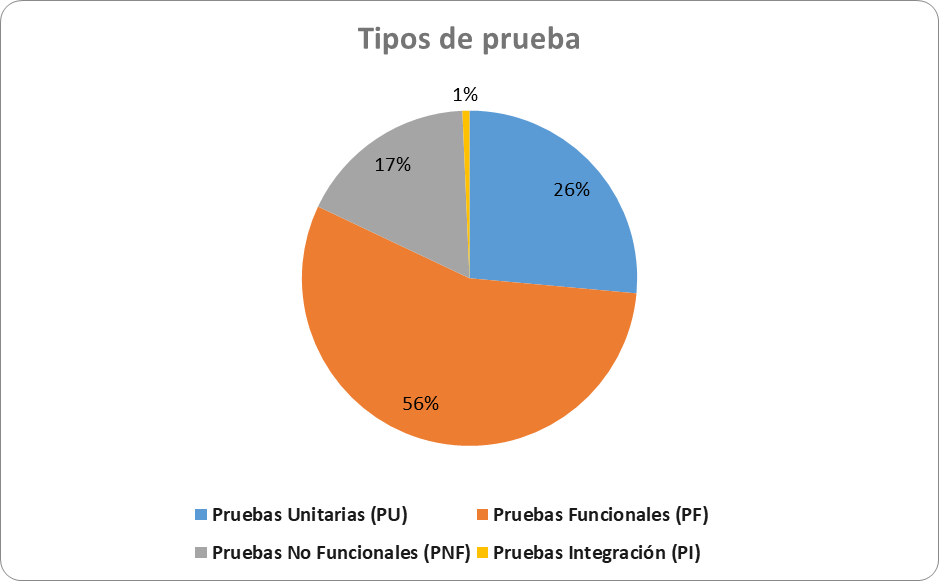
Estados de pruebas:
    - No ejecutado: 58
    - Bloqueado: 2
    - Fallado: 88
    - Pasado: 147
    
Casos de pruebas:
    - Login: 17
    - standard_user: 46
    - locked_out_user: 46
    - problem_user: 46
    - performance_glitch_user: 46
    - error_user: 46
    - visual_user: 48
    

En este informe detallado, encontrarán los resultados de los casos de prueba ejecutados, incluyendo el desglose por tipo de prueba y los estados resultantes. Este análisis proporciona una visión integral de la cobertura de pruebas y el rendimiento del sistema en diferentes escenarios.

#Seguimiento:
    Con base en los tipos de pruebas realizadas, se destaca la posibilidad de realizar pruebas a base de riesgo, especialmente si el proyecto así lo requiere. Además, este informe se presenta al Product Owner (PO), Líder de QA y otras partes interesadas para las siguientes acciones:

    Asignación de Incidencias:
        Las incidencias encontradas se asignarán a los desarrolladores pertinentes para su atención.
    Análisis de Incidencias:
        Se realizará un análisis para determinar si estas incidencias se abordarán en el actual sprint o en futuros sprints, según la prioridad y complejidad.
    Solución de Incidencias:
        Una vez que los desarrolladores reporten la solución de estas incidencias, se llevarán a cabo pruebas de regresión para verificar que estén solucionadas y que la corrección no afecte el resto del sistema.

Este enfoque nos permitirá mantener un ciclo eficiente de desarrollo y asegurar la calidad del sistema en cada iteración.

El informe completo está disponible para su revisión. Agradezco cualquier comentario o pregunta al respecto.
